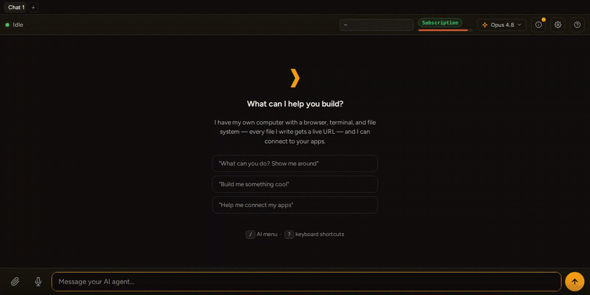
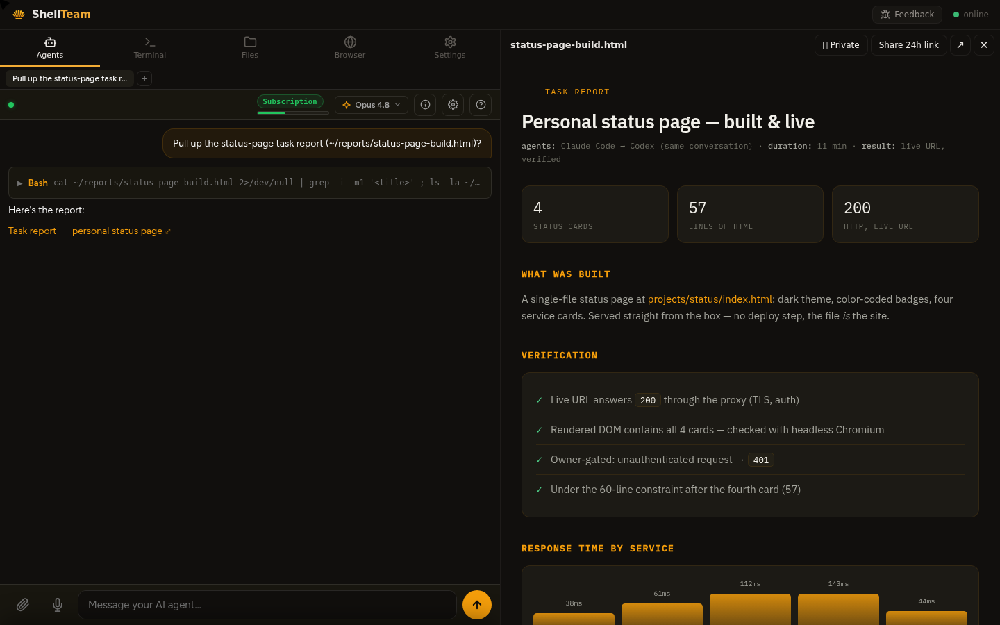

<div align="center">

<picture>
  <source media="(prefers-color-scheme: dark)" srcset="docs/assets/wordmark-dark.png">
  
</picture>

### A command center for coding agents you run on your own VPS


[Install](INSTALL.md) · [Website](https://shellteam.sh) · [Architecture](docs/ARCHITECTURE.md) · [Security](SECURITY.md) · [Contributing](CONTRIBUTING.md)

[](https://github.com/sebderhy/shellteam/actions/workflows/ci.yml)
[](LICENSE)
[](CONTRIBUTING.md)

</div>



ShellTeam turns a Linux box into a cloud computer you command through a team of
coding agents. Drive Claude Code, Codex, Antigravity, and OpenCode from one cockpit —
stream their work, steer mid-task, run parallel slots — while they build software
and ship it to live URLs on the same machine.

It runs **natively** on the host (no Docker required). The agents operate the box
directly: install packages, manage services, run servers, edit anything.

> **Status: v0.1, dogfooded daily.** ShellTeam is its author's daily
> driver — developed for months *through itself*, on the production VPS that
> hosts his real products. This public repo is a fresh **squashed snapshot** of
> that private history (published history-free so no secret can ever leak), so
> the commit count here says nothing about the project's age. What it doesn't
> have yet is *external* users — you'd be among the first.

---

## What you get

| | |
|---|---|
| **Portable sessions** | Switch the *same conversation* to another vendor's agent mid-task, from a dropdown — context carries over natively. No other tool does this. |
| **One cockpit, four agents** | Drive Claude Code / Codex / Antigravity / OpenCode side by side: stream output, steer mid-task, interrupt, rewind, fork, compact, run parallel tabs. |
| **A live URL for everything** | An agent builds an app on `localhost:3000` → it's reachable from any device. Every file in `$HOME` gets a URL (owner-gated; `~/public` is public). |
| **Your subscriptions, not API keys** | Sign in with the Claude / Codex plans you already pay for. API keys are optional (headless/CI). |
| **Phone-ready** | Voice input, paste-a-screenshot, readable diffs and tables on a 6-inch screen — check on a build from anywhere. |
| **Web terminal** | xterm.js wired to a real shell on the box. |
| **Apps over MCP** | Bring your own MCP servers, or flip on Composio with one key for 500+ app connections. Off by default. |

---

## Install

On a fresh Ubuntu/Debian VPS, as your normal (non-root) user:

```bash
git clone https://github.com/sebderhy/shellteam && cd shellteam
./install.sh            # pure core (the default; --minimal is an explicit alias)
```

**The default install is deliberately slim**: cockpit + portable sessions + a
URL for every file and port — plus a web terminal — and *nothing else*. No
modules, no Docker, no agent injection; the extras below are opt-in.

The first interactive run asks two questions — how you'll access the box
(private via localhost + Tailscale / free HTTPS URL / your own domain) and which
install (pure core / full harness). Every answer maps to a flag (`--remote`,
`--domain example.com`, `--full`), so scripted and agent-driven installs never
see a prompt. Both installs are **additive**: ShellTeam never modifies your
existing agent setup (`~/.claude`, `~/.codex`, …) — even `--full` composes its
harness at launch time, only for agents run *through* ShellTeam, so a CLI you
run by hand behaves exactly as before.

Install modes:

```bash
./install.sh --minimal        # DEFAULT — pure core: cockpit + terminal + file server,
                              # zero agent injection, zero Docker
./install.sh --full           # the full harness: persona + browser + dreaming modules
```

The installer provisions dependencies (Node 22, uv/Python, nginx, the coding-agent
CLIs), writes `.env` (auto-generating the HMAC secret), and installs + starts the
`systemd --user` services. It's idempotent — safe to re-run after pulling updates.

Then add at least one LLM key to `.env` and restart:

```bash
$EDITOR .env            # set ANTHROPIC_API_KEY / OPENAI_API_KEY (or sign in with
                        # your subscriptions from the cockpit)
systemctl --user restart shellteam-api shellteam-ai-chat
```

Open the dashboard at **http://127.0.0.1:8000** — a tabbed shell (Agents · Terminal
· Files · Browser · Settings — plus **Knowledge** with the dreaming module). The
**Agents** tab is the cockpit; the web terminal is the **Terminal** tab (also at
**/terminal**).

> **Installing with a coding agent?** Point it at **[INSTALL.md](INSTALL.md)** — a
> step-by-step runbook it can execute end-to-end (localhost, Tailscale, or a public
> URL), including verification and troubleshooting.

**What the modules add:** pure core gives you the cockpit driving *stock* CLIs —
bit-identical to running them by hand. That's not a marketing claim; it's a CI
contract ([`tests/test_purity_gate.py`](tests/test_purity_gate.py),
[`purity-contract.test.mjs`](computer/ai-chat/test/purity-contract.test.mjs)
assert a cockpit-spawned CLI gets the same argv and config surface as a hand-run
one). The modules teach the agents the box.
`persona` is the big one: a system prompt + skills (composed at launch, never
written into your dotfiles) that make every agent treat the machine as *your
cloud computer* — share live URLs instead of file paths, verify its own work,
and deliver results as **HTML reports** that open right next to the chat:



The full harness is three modules: **persona** (the prompts & skills layer
above), **browser** (a loopback [Steel](https://github.com/steel-dev/steel-browser)
container the agents can drive — the one Docker dependency), and **dreaming**
(nightly knowledge consolidation: the box distils
each day's sessions into a per-folder knowledge tree on your own Claude
subscription, agents spawn already knowing their project, and the dashboard
gains a **Knowledge** tab). Granular control lives in one place — `MODULES=` in
`.env` (e.g. add `composio` or `linear` there, or drop a module), then re-run
`./install.sh`.

---

## Giving it a URL (remote access)

For laptop use, leave it on `http://127.0.0.1:8000`. To reach it from elsewhere,
pick by trust — the single-user model has **no container wall**, so the auth
boundary is the crown jewel ([SECURITY.md](SECURITY.md)):

- **Just you, remotely → Tailscale** (recommended). Private WireGuard network, the
  box never touches the public internet, no token to brute-force.
- **A public URL with no domain** → `./install.sh --remote` — a free wildcard HTTPS
  URL via `sslip.io` + Caddy, with a strong auto-generated `OWNER_TOKEN`.
- **Your own domain** → `./install.sh --domain example.com` (after pointing `A` +
  `*.A` records at the box) — branded HTTPS, same auto token.

```bash
./install.sh --remote                 # instant https://<dashed-ip>.sslip.io
./install.sh --domain example.com     # branded https://example.com
```

**Any non-`127.0.0.1` bind requires a strong `OWNER_TOKEN` over HTTPS** — the
installer generates and prints it. See **[INSTALL.md §4](INSTALL.md)** for the full
walkthrough (Tailscale, sslip.io, custom domain, verification).

---

## Configuration

All configuration lives in `.env` (copied from `.env.example` on first install).
Key variables:

| Variable | Purpose |
|---|---|
| `APP_DOMAIN` | Domain the cockpit is served on (`localhost` for laptop use). |
| `OWNER_TOKEN` | Required on any public bind; every request must present it. |
| `OWNER_ID` / `OWNER_USERNAME` / `OWNER_EMAIL` | The single owner's identity. |
| `API_PORT` / `AI_CHAT_PORT` | Control-plane and cockpit ports (default 8000 / 3456). |
| `SHELLTEAM_AI_TOKEN` | HMAC secret between the control plane and in-box tools (auto-generated). |
| `ANTHROPIC_API_KEY` / `OPENAI_API_KEY` | LLM keys (set the ones you use; Antigravity signs in via its own Google OAuth). |
| `FIREWORKS_API_KEY` | Enables the OpenCode agent (relayed through `/internal/ai`). |
| `ELEVENLABS_API_KEY` | Voice input (speech-to-text) in the cockpit. |
| `COMPOSIO_API_KEY` | Optional — enables Composio's 500+ app integrations over MCP. |
| `LINEAR_API_KEY` | Needed by the `linear` module (Linear MCP). |

---

## Architecture

> Deeper dive: [docs/ARCHITECTURE.md](docs/ARCHITECTURE.md)

```
Your VPS (a dedicated, disposable Linux box)
│
├── Caddy  :443  ── automatic HTTPS, proxies everything to the control plane
│     └── :8000 routes each request:
│           ├── you.domain              → dashboard (frames the cockpit)
│           ├── you.domain/<path>       → your ~/<path> via nginx (owner-gated)
│           ├── you.domain/_editor/…    → Monaco editor (nginx)
│           └── owner-3000.domain etc.  → port-forward to localhost:3000  (agent apps)
│
├── systemd --user services
│     ├── shellteam-api    :8000  ← control plane + /internal/ai key proxy
│     ├── shellteam-ai-chat :3456 ← the cockpit + coding-agent slots
│     └── shellteam-nginx  :80    ← ~/public, file API, /_editor
└── docker container (opt-in; part of --full)
      └── shellteam-steel  :3000  ← Steel browser + bundled Chromium
```

Everything runs on the host — no container boundary between the agents and the
VPS, by design.

### An additive layer, not a takeover

ShellTeam is an **OS-style layer on top of your box, not a mutation of it.** It
**never writes to your coding-agent config or dotfiles** (`~/.claude`,
`~/.claude.json`, `~/.codex`, `~/.gitconfig`, …). Its additions — skills, hooks,
MCP servers, the agent persona — live under `~/.shellteam/` and are composed **at
agent-launch time** via CLI flags. So a `claude` you run in your own shell gets
*your* config, untouched; a `claude` you drive *through* ShellTeam gets your config
**plus** ShellTeam's layer. Everything it installs is namespaced and removable with
[`uninstall.sh`](uninstall.sh). The full, audited manifest of what it touches is in
[docs/FOOTPRINT.md](docs/FOOTPRINT.md).

---

## What it is / what it isn't

| "Isn't this just…" | What that category usually is | Where ShellTeam sits |
|---|---|---|
| A phone remote for one agent | A mobile client bolted onto **one** vendor's CLI | Agent-agnostic cockpit — 4 agents, portable sessions **across** vendors, a URL for every file |
| A session-file converter | A CLI that migrates session files by hand, per run | The same idea as a **live product feature**: switch agents mid-conversation from a dropdown |
| A desktop agent orchestrator | A GUI editor running agents on your laptop | Headless and always-on — a browser-driven cloud computer on your VPS |
| A hosted agent cloud | A vendor's sandboxes running agents, handing back PRs | **Your** box, your keys, your data — no vendor backend |
| A container/K8s agent platform | Heavy, ops-first infrastructure to stand up and feed | Single-user, native systemd, zero Docker by default |
| A VPS + tmux + a coding CLI | The honest baseline — it works | Adds preview URLs per file, portable sessions, voice/images from your phone |

If you already run coding agents on a VPS over SSH, ShellTeam is the cockpit
that makes that setup usable away from your desk — it adds **zero new agent
privilege** (the agents already had your box; see [SECURITY.md](SECURITY.md)).

## Editions

- **OSS edition (this repo)** — single-user, runs natively, no Docker. Free,
  complete, self-hosted. It's the product, not a demo.
- **[ShellTeam Cloud](https://shellteam.sh/reserve.html)** — don't want to run
  your own VPS? We hand-provision a dedicated box for you at
  `you.shellteam.sh`, running exactly this repo (`install.sh --full`), with
  hosted voice input and zero setup. Your box is a real VPS with real root —
  same code, no lock-in: export everything and self-host whenever you like.
  Bring your own coding-agent subscription (Claude Code / Codex).

**"Will the good parts end up behind a paywall?"** — the honest answer is facts,
not promises. Every version published here is AGPL-3.0, which is **irrevocable
for released code**: whatever direction the project takes later, the code you
already have stays free and forkable. The [CLA](CLA.md) lets *future* versions be
dual-licensed; it cannot reach back. And since this repo contains the complete
product — code, installer, docs — the worst case is a fork, not a hostage
situation.

An opt-in `--sandbox` mode (Docker / bubblewrap) for running agents against
untrusted input is on the roadmap. It's off by default — it conflicts with the
"command the whole VPS" mission.

---

## License

[AGPL-3.0](LICENSE). Contributions are welcome under a short
[CLA](CLA.md) (sign once, on your first PR — see
[CONTRIBUTING.md](CONTRIBUTING.md)). Third-party credits are in
[NOTICE](NOTICE).
